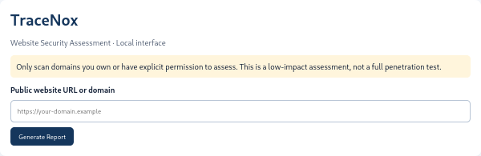
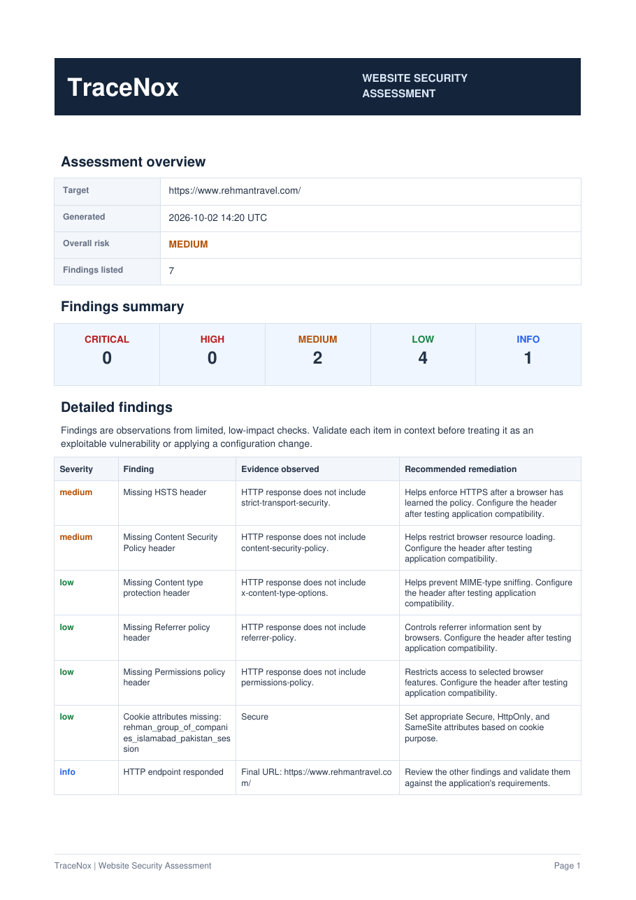

# TraceNox

**Evidence-Driven Cybersecurity Investigation Toolkit**

TraceNox is a Python-based cybersecurity investigation toolkit for analyzing Linux SSH authentication logs, identifying suspicious login behavior, correlating IP risk information, and generating structured investigation reports.

It is designed to help cybersecurity students, analysts, and security practitioners examine authentication activity using log evidence rather than hard-coded demonstration results.

## Features

- **SSH Log Analysis** — Parse Linux SSH authentication events.
- **Suspicious Login Detection** — Identify repeated failed logins and successful authentication following repeated failures.
- **IP Investigation** — Summarize authentication activity by source IP.
- **Risk Scoring** — Calculate risk scores using observed authentication behavior.
- **IP Risk Correlation** — Combine local behavioral risk with external reputation data when available.
- **AbuseIPDB Integration** — Optionally query public IP reputation using an API key.
- **Investigation Timeline** — Present parsed authentication events chronologically.
- **Evidence Preservation** — Retain raw log evidence supporting investigation findings.
- **Multiple Report Formats** — Generate text, JSON, and HTML reports.
- **Integrity Metadata** — Generate SHA-256 integrity information for the analyzed source.
- **Systemd Journal Analysis** — Analyze journal entries for a selected unit and time range.
- **Hash Verification** — Verify a file against an expected SHA-256 hash.

## Detection Capabilities

### 1. SSH Failed Login Burst

Identifies repeated failed SSH authentication attempts from the same source IP.

### 2. Failed Attempts Followed by Successful Login

Detects a successful authentication event following repeated failed login attempts and associates relevant log evidence with the finding.

### 3. IP-Based Risk Assessment

Summarizes failed and successful authentication activity for each source IP and calculates a local behavioral risk score.

### 4. Correlated IP Risk

When external reputation information is available, TraceNox combines local behavioral risk and external abuse confidence into a correlated score. When reputation data is unavailable or not requested, it retains the local score and indicates that the result is local-only.

The correlated score uses a 60% local-risk and 40% external-reputation weighting, with an additional corroboration adjustment when both risk indicators meet the configured thresholds.

**Important:** A risk score is an investigation aid, not proof that an IP address is malicious. Interpret results in context and validate findings against the original evidence.

## Requirements

- Linux environment (Kali Linux recommended)
- Python 3.13 or compatible version
- Git
- `pytest` for running the test suite
- An AbuseIPDB API key only if external IP reputation lookup is required

## Installation

Clone the repository:

```bash
git clone https://github.com/syedshahriyarahmad/TraceNox.git
cd TraceNox
```

Create and activate a virtual environment:

```bash
python3 -m venv .venv
source .venv/bin/activate
```

Install the test dependency:

```bash
python -m pip install pytest
```

If the project provides a dependency file, install its dependencies as well:

```bash
if [ -f requirements.txt ]; then
    python -m pip install -r requirements.txt
fi
```

## Usage

### Analyze an authentication log

```bash
python -m tracenox.cli.main /var/log/auth.log
```

The log file must be readable by your user. On some Linux distributions, authentication logs may be stored at `/var/log/secure` instead.

### Generate JSON and HTML reports

```bash
python -m tracenox.cli.main /var/log/auth.log \
  --json reports/investigation.json \
  --html reports/investigation.html
```

TraceNox prints a human-readable report in the terminal and saves the requested output files.

### Analyze a sample log

From the repository directory:

```bash
python -m tracenox.cli.main test_auth.log \
  --json reports/investigation.json \
  --html reports/investigation.html
```

The included sample log is for demonstration and testing. Its events should not be interpreted as evidence of a real attack.

### Analyze the systemd journal

```bash
python -m tracenox.cli.main --journal
```

Specify a unit and time range when needed:

```bash
python -m tracenox.cli.main --journal --unit ssh --since today
```

Journal analysis requires the appropriate systemd environment and permissions.

## Optional: IP Reputation Lookup

TraceNox supports optional external reputation lookups through AbuseIPDB. Configure your API key in the environment rather than hard-coding it into source files:

```bash
export ABUSEIPDB_API_KEY="YOUR_API_KEY"
```

Run the analysis with reputation lookup enabled:

```bash
python -m tracenox.cli.main /var/log/auth.log \
  --ip-reputation \
  --json reports/investigation.json \
  --html reports/investigation.html
```

External lookups depend on network connectivity, API availability, API limits, and whether the IP is eligible for lookup. Private and local IP addresses are not equivalent to publicly reported addresses. Without usable external reputation data, TraceNox reports local-only risk.

## File Integrity Verification

TraceNox supports standalone SHA-256 verification.

Calculate a file's SHA-256 hash:

```bash
sha256sum test_auth.log
```

Pass the expected hash to TraceNox:

```bash
python -m tracenox.cli.main \
  --verify-hash test_auth.log \
  --expected-sha256 YOUR_64_CHARACTER_SHA256_HASH
```

Use a trusted expected hash. A hash comparison can detect changes relative to that expected value; it does not independently prove the authenticity of the original file.

## Running Tests

From the repository root with the virtual environment activated:

```bash
pytest -q
```

The test suite covers parsing, detection, risk scoring, reporting, and other implemented functionality.

## Project Structure

```text
TraceNox/
├── tracenox/
│   ├── analyzer/
│   │   ├── evidence.py
│   │   ├── integrity.py
│   │   ├── ip_reputation.py
│   │   ├── ip_summary.py
│   │   ├── log_reader.py
│   │   ├── pipeline.py
│   │   ├── ssh_parser.py
│   │   └── timeline.py
│   ├── detection/
│   │   ├── risk_correlation.py
│   │   ├── risk_scoring.py
│   │   └── ssh_detection.py
│   ├── reporting/
│   │   ├── html_report.py
│   │   └── text_report.py
│   └── cli/
│       └── main.py
├── tests/
├── reports/
├── test_auth.log
├── README.md
└── .gitignore
```

This is a simplified overview; the repository may contain additional files.

## Responsible Use

- Analyze logs you own or are authorized to investigate.
- Protect authentication logs because they may contain sensitive operational information.
- Review findings against original log evidence before taking action.
- Treat automated scores and external reputation results as supporting indicators rather than definitive attribution.
- Avoid publishing reports containing private IP details, usernames, or other sensitive information without appropriate review.

## Current Project Status

TraceNox includes SSH authentication analysis, detection rules, per-IP risk assessment, optional external IP reputation enrichment, risk correlation, integrity metadata, and text/JSON/HTML reporting.

Features and results should be evaluated against the current source code and test suite. No claim of complete enterprise-grade monitoring or guaranteed attack detection is made.

## Author

**Syed Shahriyar Ahmad**

GitHub: [@syedshahriyarahmad](https://github.com/syedshahriyarahmad)

## License and Copyright

Copyright (c) 2026 Syed Shahriyar Ahmad. All rights reserved.

This repository is publicly viewable for portfolio and evaluation
purposes. No general permission is granted to copy, modify,
redistribute, or commercially use this software without prior
written permission from the copyright holder, except where
applicable law provides otherwise.

Public visibility does not mean the software is released under
an open-source license.


## Quick start

Install TraceNox in a Python virtual environment:

```bash
python -m pip install -e .
tracenox --help
```

Analyze an SSH authentication log:

```bash
tracenox /var/log/auth.log
```

Generate JSON and HTML reports:

```bash
tracenox /var/log/auth.log --json report.json --html report.html
```

Verify a file's SHA-256 digest:

```bash
sha256sum /var/log/auth.log
tracenox --verify-hash /var/log/auth.log --expected-sha256 YOUR_64_CHARACTER_SHA256
```

An empty or unrecognized log is not proof that a system is secure.
Review analysis warnings and validate that the input contains the expected
log format before drawing conclusions.

## Website assessment (v0.3.0)

Use only on public websites you own or are explicitly authorized to assess.
This module performs low-impact DNS, HTTP-header, redirect, cookie-attribute,
and TLS certificate checks. It does not perform a full penetration test.

```bash
python -m pip install -e .
tracenox-web --help
tracenox-web https://example.com --json website-report.json --html website-report.html
```

The scanner blocks non-public IP addresses and rejects URLs containing
embedded credentials. DNS protections are best-effort and do not eliminate
all DNS rebinding risks; run only against approved targets. A missing security
header is an observation, not proof of a vulnerability.

## Current Web Dashboard and PDF Reports (v0.4.1)

TraceNox includes a local Flask dashboard for low-impact website security
configuration checks and PDF report generation.

### Start the dashboard

Activate the project's virtual environment and start the application:

```bash
cd ~/TraceNox
source .venv/bin/activate
python -m tracenox.webapp
```

Open http://127.0.0.1:5050 in your browser.

### Website scan workflow

1. Choose a website you own or have explicit permission to assess.
2. Submit its URL through the local dashboard.
3. Review the scan findings and severity levels.
4. Examine the evidence observed and recommended remediation.
5. Download and review the PDF report.
6. Validate findings in context before changing any configuration.

### PDF report contents

The report presents findings in separate columns for:

- Severity
- Finding
- Evidence observed
- Recommended remediation

It also includes a summary and technical scan details. Automated configuration
checks are observations, not proof that a vulnerability is exploitable.
Validate findings before taking action.

### Web scanner limitations

- Checks cover only the behavior and configuration examined by the scanner.
- Results may require manual verification.
- A scan cannot guarantee that a website is secure or vulnerable.
- Use the scanner only on systems you are authorized to assess.

The Flask development server is intended for local testing, not public
production deployment.

## Dashboard Preview



## Security Scan Results



## Sample PDF Report

[View Sample Security Report](docs/sample-reports/tracenox-sample-report.pdf)
